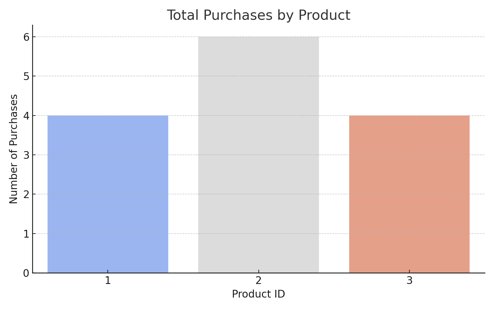

# 🍽️ The Zomato Project — SQL Analytics Case Study

<div align="center">
  
</div>


> A SQL-based mini case study that simulates a food-tech platform like Zomato.  
> We explore user behavior, product performance, gold membership benefits, and a points-based reward system using a **sample dataset**.

🧠 Designed to work on **sample data**, yet scalable to any large-scale food delivery dataset!

---

## 📦 Dataset Overview

We simulate 4 core tables:

| Table Name         | Description                                      |
|--------------------|--------------------------------------------------|
| `users`            | User info & signup date                          |
| `sales`            | Transaction log (user, date, product purchased)  |
| `product`          | Menu items and prices                            |
| `goldusers_signup` | Records of users joining the Gold membership     |

> 💡 The dataset was generated using basic SQL insert statements. The goal was to analyze behavior, loyalty, and business impact using SQL only.

---

## 🛠 Tools Used

- **PostgreSQL** – For executing SQL queries
- **VS Code / DBeaver** – SQL IDE
- **Git & GitHub** – Version control and code management

---

## ❓ Business Questions Answered

Below is the list of analytical questions explored through SQL in this project:

1. 💸 What is the total amount each customer spent on Zomato?
2. 📅 How many days has each customer visited the platform?
3. 🛍️ What was the **first product** purchased by each customer?
4. 🔥 What is the **most purchased product** on the menu, and how many times was it bought?
5. 👤 What is the **most popular product for each individual customer**?
6. ⭐ What product was purchased **after** becoming a Gold Member?
7. ⏮️ What was the **last product bought before** a customer became a Gold Member?
8. 📦 What is the **total number of orders and amount spent** by each member **before** joining the Gold program?
9. 🧮 Using a custom reward system, how many **Zomato points** did each customer and each product accumulate?
10. 🗓️ In the **first year of Gold Membership**, how many points did users earn using a fixed reward scheme (5 points per ₹10)?
11. 🏆 Rank all transactions of each customer based on their date.
12. 🥇 Rank **only Gold Member transactions**, and assign `"NA"` to those that were not made under the membership.

---

## 🧠 Analysis Overview

For the complete list of queries and data preparation steps, feel free to explore the SQL scripts in this folder:  
📂 [View Full SQL Queries](./zomato_queries.sql/)

---

Rather than list each query, let's focus on the **key business insights** that emerged from this project:

### 📌 Highlights From Our Analysis

- **📊 Most Purchased Product:**  
  We identified the most frequently ordered item on the menu — this helps prioritize popular products in marketing and inventory planning.

```sql
SELECT userid, COUNT(product_id) as No_of_Purchases
FROM sales 
WHERE product_id = (
    SELECT s.product_id as Product_ID
    FROM sales s
    GROUP BY s.product_id
    ORDER BY COUNT(userid) DESC
    LIMIT 1
)
GROUP BY userid;
```

<div align="center">
  
</div>


- **🎯 Post-Membership Behavior:**  
  Analyzed the first product users purchased after joining the Gold Membership program. Repeated patterns here indicate products that keep users engaged after upgrade.

```sql
SELECT userid, product_id
FROM (
	SELECT s.userid, s.product_id, DENSE_RANK() OVER(PARTITION BY s.userid ORDER BY s.created_date) as rn
	FROM (
		SELECT * 
		FROM sales
		ORDER BY userid, created_date
		) AS s
	JOIN goldusers_signup g ON s.userid = g.userid AND s.created_date>g.gold_signup_date
	) 
WHERE rn = 1;
```
**Result Set**

| User ID | Product ID |
|---------|------------|
| 1       | 3          |
| 3       | 2          |

*This insight helps identify what products are most appealing to users right after joining the Gold program.*


- **⏮️ Pre-Membership Trigger:**  
  Found the last product purchased *before* users became members. If common, this product may have influenced their decision to upgrade — valuable for upsell strategies.

```sql
SELECT userid, product_id
FROM (
	SELECT s.userid, s.product_id, DENSE_RANK() OVER(PARTITION BY s.userid ORDER BY s.created_date DESC) as rn
	FROM (
		SELECT * 
		FROM sales
		ORDER BY userid, created_date
		) AS s
	JOIN goldusers_signup g ON s.userid = g.userid AND s.created_date<=g.gold_signup_date
	) 
WHERE rn = 1;
```

**Result Set**


- **🏅 Reward Points Simulation:**  
  Designed a custom point system based on product pricing (e.g., 5₹ = 1 point). We calculated total points per user and per product, offering insight into loyalty performance by item. Here's why it stood out:

- **🧠 Logic Building & Customization:**  
  I created a tiered points system where each product had its own conversion logic (e.g., 5₹ = 1 point for some, 10₹ = 5 points for others). This challenged me to think creatively and structure my `CASE` statements effectively.

- **💼 Real-World Business Application:**  
  Reward programs are crucial in increasing customer retention. This exercise showed me how to simulate such programs using SQL, helping businesses measure engagement and identify high-performing products in loyalty campaigns.

- **📊 Analytical Depth:**  
  By analyzing total points earned per user and per product, I could identify:
  - Which customers are most loyal.
  - Which products drive repeat purchases and retention.
  - Potential for bonus campaigns (e.g., double points on low-selling items).

- **🔁 Scalable Logic:**  
  I now understand how this system could scale in real-life platforms like Zomato or Swiggy, integrating with dashboards and influencing targeted offers.

### 💡 What I Learned
- Used arithmetic operations + conditional logic (`CASE`) in SQL to simulate a flexible business logic layer.
- Learned how to **quantify engagement** and turn raw purchase data into **measurable loyalty metrics**.
- Gained insight into how **custom KPIs** (like points) can be tracked for both users and products.

These insights bridge raw transaction data with business value — helping decision-makers understand customer behavior, membership effectiveness, and reward optimization.

---

## 🧠 What I Learned

This project was a great opportunity to apply and deepen my SQL skills in a realistic, business-oriented scenario. Here’s what I gained from the experience:

- **📊 Analytical Thinking:** Learned how to transform business questions into precise SQL queries and extract meaningful insights from transactional data.
- **🧱 Data Modeling Awareness:** Understood how different tables (users, products, sales, memberships) relate and how to join them meaningfully for layered analysis.
- **🏷️ Window Functions Mastery:** Practiced using powerful SQL tools like `RANK()`, `DENSE_RANK()`, and `ROW_NUMBER()` for solving sequencing and ranking problems.
- **🧮 Logic Building for Rewards:** Simulated custom logic such as Zomato points, combining arithmetic and CASE statements — a great exercise in creative SQL.

---

## 📌 Conclusion

Through this project, I was able to:

- Recreate a simplified but realistic Zomato-like ecosystem.
- Analyze customer behavior before and after joining the loyalty program.
- Evaluate which products performed best and how user preferences changed with Gold Membership.
- Simulate a loyalty point system to explore its potential effectiveness.

This exercise mirrors real-world business intelligence work — turning raw transactions into strategic insights.

---

## 🚀 Future Scope

- **Visualization Integration:** The next step is to visualize these insights using tools like **Power BI** or **Tableau**, making the analysis more digestible for non-technical stakeholders.
- **Bigger Dataset Simulation:** Apply the same queries and logic to larger datasets, possibly with millions of records, to test scalability and performance.
- **Automation & Reporting:** Build dashboards and automate such analyses to support ongoing product or marketing decisions.

---

## 🙌 Closing Thoughts

This was more than just a SQL practice project — it was a chance to think like a **business analyst**. Every query had a purpose. Every insight told a story. Projects like these build the foundation for real-world analytics roles, and I’m excited to take this learning forward.

Thanks for checking out **The Zomato Project**! 🍽️


